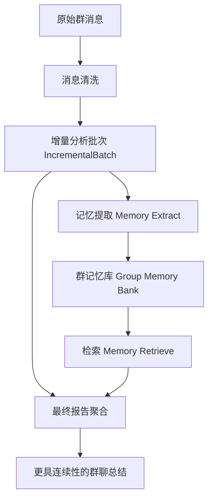

# 13. 群聊总结记忆模块提案 (Group Memory Proposal)

## 1. 背景与目标

当前插件已经具备以下能力：

- 以群为单位抓取消息并做一次性全量分析。
- 以群为单位执行增量分析，并将结果沉淀为 `IncrementalBatch`。
- 在最终报告阶段，基于窗口内累积数据生成话题、金句、用户称号与聊天质量总结。

这套链路已经很好地解决了“今天聊了什么”的问题，但还没有真正解决“这个群一直在聊什么、这群人分别是什么风格、今天的内容与历史脉络是什么关系”这三个更高阶的问题。

如果我们希望总结更有“群味”，就需要引入一层长期记忆系统，让插件从“按天生成报告的分析器”升级为“对每个群拥有持续认知的总结 Agent”。

本提案的目标是：

- 为插件引入天然分群的长期记忆能力。
- 在群级记忆之下，为每个成员构建长期画像，但画像仅在该群作用域内生效。
- 让最终总结能够引用“近期上下文 + 历史脉络 + 人物画像”，生成更具连续性、辨识度和趣味性的分析结果。
- 复用当前的增量分析与 KV 存储架构，避免另起一套重系统。
- 在设计上预留遗忘、安全、回滚和逐步上线能力。

## 2. 设计原则

本方案借鉴“记忆系统”相关研究的核心思想，但会严格贴合当前插件的实际边界。

### 2.1 作用域优先于全局统一

“天然分群”是第一原则。记忆不是全局共享的，而是默认按群隔离。

- 同一个用户在不同群的画像必须分开。
- 同一平台不同群必须分开。
- 不同平台即使群号相同，也必须分开。
- Telegram 话题子会话、Discord 频道等特殊场景，应允许在群级作用域下继续细分。

### 2.2 记忆不是原始聊天记录的简单堆积

原始消息属于“可回放的数据源”，不是“可直接喂给总结器的记忆”。

记忆层应该只保存经过抽取、压缩、结构化后的高价值信息，包括：

- 群级长期主题与 recurring 梗。
- 成员长期角色、风格、兴趣、关系倾向。
- 对总结真正有帮助的事件片段与证据引用。
- 可供检索和动态拼装的摘要单元。

### 2.3 短期记忆和长期记忆分层

参考当前插件现状，可以将记忆分成两层：

- 短期记忆：当前分析窗口内的消息、增量批次、当日热点。
- 长期记忆：跨天持续存在的群画像、成员画像、稳定话题、长期事件线索。

短期记忆回答“今天发生了什么”，长期记忆回答“这件事在这个群里意味着什么”。

### 2.4 先做可控的文本结构化记忆，再考虑向量化增强

第一阶段不建议直接引入复杂向量数据库。更适合基于当前 KV 架构先实现：

- 结构化事实卡片
- 事件摘要
- 群画像快照
- 成员画像快照
- 检索排序逻辑

等第一版跑稳，再视需要增加 embedding 检索。

### 2.5 安全、遗忘、可审计是基础能力

长期记忆一旦落地，就不再只是“功能增强”，而是“长期持有群内认知”的系统。因此必须一开始就考虑：

- 敏感信息不过度沉淀。
- 可以按群清除、按人清除、按时间淘汰。
- 每条高价值记忆尽量保留来源批次和时间区间。
- 对投毒内容、恶搞内容、短期异常行为有抑制机制。

## 3. 与当前实现的关系

当前代码中，已经存在非常适合作为记忆系统底座的能力：

- `MessageProcessingService` 负责消息进入插件侧存储。
- `AnalysisApplicationService.execute_incremental_analysis()` 负责把新消息切成增量批次。
- `IncrementalBatch` 已经保存了用户统计、话题、金句、参与者等中间结构。
- `IncrementalStore` 已经实现了“按群分桶 + 索引 + 单条 KV”的持久化模式。
- `IncrementalMergeService` 已经实现了“窗口查询 -> 合并聚合 -> 最终报告”的工作流。

这意味着我们不需要新造一套完全独立的 pipeline，而是可以在现有链路上增加一层 `Memory Pipeline`：



核心思路不是替换当前分析流程，而是在“增量批次”和“最终报告”之间增加一个长期记忆闭环。

## 4. 记忆系统总体架构

### 4.1 两条主线

本提案建议把记忆拆成两条并行主线：

1. 群级记忆
2. 群内成员画像

它们共享同一个群作用域，但负责不同层面的认知沉淀。

### 4.2 群级记忆

群级记忆关注“这个群整体是什么样的”。

建议长期维护以下内容：

- 稳定话题带：这个群最近长期反复出现的话题、梗、项目、活动。
- 群体互动风格：高能整活、技术答疑、日常陪聊、吐槽、运营协作等。
- 群体事件线：某个持续数天甚至数周的话题演变。
- 群体角色结构：谁是活跃核心、谁是梗王、谁常带节奏、谁负责答疑。
- 历史高光片段：值得在总结中反复引用的经典事件或金句。

### 4.3 群内成员画像

成员画像关注“这个人在这个群里通常扮演什么角色”。

注意这里的画像必须是“群内画像”，而不是跨群统一人格。

建议维护的维度：

- 基础活跃特征：发言频次、活跃时段、长短文倾向、回复倾向。
- 话题偏好：更常参与哪类讨论。
- 风格特征：认真解答型、吐槽型、整活型、观察型、组织者型等。
- 表达习惯：常用口头禅、格式偏好、语气特征、梗密度。
- 群内角色：提问者、答疑者、情报员、乐子人、记录员等。
- 稳定关系线索：经常和谁互动、常在谁的话题下接话。
- 置信度与更新时间：画像是否稳定、最近是否发生明显漂移。

## 5. 作用域设计：如何做到“天然分群”

### 5.1 记忆命名空间

建议引入统一的记忆作用域 ID，而不是只使用裸 `group_id`。

推荐主键：

```text
group_scope_id = "{platform_id}:GroupMessage:{group_id}"
```

对于 Telegram 话题、Discord 线程等子空间，可以继续扩展：

```text
thread_scope_id = "{platform_id}:GroupMessage:{group_id}#{topic_or_thread_id}"
```

### 5.2 分层隔离规则

- 默认所有长期记忆写入 `group_scope_id` 命名空间。
- 如果平台具备更细的子话题结构，可以把 thread 级信息先写入 `thread_scope_id`，再在群级进行抽象汇总。
- 成员画像的主键必须包含群作用域：

```text
member_profile_key = "{group_scope_id}:{sender_id}"
```

这样可以天然保证：

- 同一个 QQ 号在 A 群和 B 群是两份画像。
- 同一个人跨平台不会误合并。
- 同一个 Telegram 父群下不同 topic 可以选择共享群画像，但保留 thread 层差异。

## 6. 记忆分类设计

### 6.1 情景记忆 (Episodic Memory)

情景记忆记录“发生过什么”。

在本插件里，适合存为：

- 每次增量批次提炼出的事件摘要
- 某日总结后的关键结论
- 多日持续话题的阶段性节点
- 高光互动或典型群事件

示例：

```json
{
  "memory_id": "episode_xxx",
  "scope_id": "qq:GroupMessage:123456",
  "type": "episode",
  "timestamp": 1710000000,
  "summary": "群里围绕 AstrBot 插件的飞书适配展开了长时间讨论，最终确认了权限预热方案。",
  "entities": ["飞书", "适配", "权限预热"],
  "participants": ["user_a", "user_b", "user_c"],
  "importance": 0.83,
  "source_batch_ids": ["batch_1", "batch_2"]
}
```

### 6.2 语义记忆 (Semantic Memory)

语义记忆记录“这个群长期是什么样、这个人长期是什么样”。

在本插件里，适合存为：

- 群长期画像
- 成员长期画像
- 稳定话题标签
- 持续关系与角色归纳

示例：

```json
{
  "profile_id": "member_xxx",
  "scope_id": "qq:GroupMessage:123456:user_789",
  "type": "member_profile",
  "stable_traits": [
    "高频参与插件开发讨论",
    "回答偏直接且技术密度高",
    "常在别人卡住时补关键实现细节"
  ],
  "topic_preferences": ["插件架构", "LLM", "平台适配"],
  "style_signals": ["理性", "高信息密度", "偶尔吐槽"],
  "confidence": 0.78,
  "updated_at": 1710000000
}
```

### 6.3 轨迹内记忆与跨轨迹记忆

按插件当前实际能力，可以这样映射：

- 轨迹内记忆：本次分析窗口中的原始消息、清洗结果、增量批次、最终聚合状态。
- 跨轨迹记忆：群画像、成员画像、历史事件卡片、长期主题索引。

其中：

- `IncrementalBatch` 更像短期情景记忆的原材料。
- `GroupMemoryBank` 才是真正的跨轨迹长期记忆。

## 7. 核心模块设计

### 7.1 新增模块一览

建议新增以下核心模块：

- `MemoryScopeResolver`
- `MemoryExtractor`
- `MemoryUpdater`
- `MemoryRetriever`
- `MemoryStore`
- `MemoryCompactor`
- `MemorySafetyGuard`

### 7.2 推荐目录结构

建议采用与当前插件一致的分层风格：

```text
src/
  application/
    services/
      memory_application_service.py
  domain/
    entities/
      memory_models.py
    services/
      memory_compactor.py
      memory_retriever.py
      memory_updater.py
  infrastructure/
    persistence/
      memory_store.py
    analysis/
      analyzers/
        memory_extractor.py
        memory_profile_analyzer.py
```

### 7.3 模块职责

#### MemoryScopeResolver

负责把平台、群号、话题等信息统一转换为记忆命名空间。

#### MemoryExtractor

负责从以下输入中抽取可沉淀的记忆单元：

- 增量批次
- 合并后的窗口状态
- 最终报告结果
- 可选的原始消息片段

提取结果不是最终写库格式，而是标准化的候选记忆：

- `EpisodeCandidate`
- `GroupFactCandidate`
- `MemberTraitCandidate`
- `RelationshipCandidate`

#### MemoryUpdater

负责把候选记忆合并进长期记忆库，处理：

- 去重
- 冲突解决
- 置信度更新
- 漂移检测
- 快照刷新

#### MemoryRetriever

负责在生成最终总结前，根据当前窗口内容检索最相关的长期记忆。

#### MemoryCompactor

负责记忆衰减、归档和淘汰，防止 KV 无限膨胀。

#### MemorySafetyGuard

负责敏感信息过滤、异常记忆降权、对抗投毒与可疑内容隔离。

## 8. 存储模型设计

### 8.1 为什么继续使用 KV

当前插件已经大量使用 `put_kv_data/get_kv_data`，并且 `IncrementalStore` 已经证明这条路在插件规模下是可行的。

因此第一版长期记忆建议继续采用 KV 模式，原因有三点：

- 与现有基础设施完全兼容。
- 开发成本低，迁移风险小。
- 足以支撑“按群索引 + 按条加载 + 定期清理”的模式。

### 8.2 推荐 KV 键设计

```text
mem_group_profile_{scope_id}
mem_member_profile_{scope_id}_{user_id}
mem_episode_index_{scope_id}
mem_episode_{scope_id}_{memory_id}
mem_fact_index_{scope_id}
mem_fact_{scope_id}_{memory_id}
mem_relation_index_{scope_id}
mem_relation_{scope_id}_{pair_id}
mem_snapshot_{scope_id}
mem_meta_{scope_id}
```

### 8.3 推荐实体

#### GroupProfile

群的长期语义画像。

建议字段：

- `scope_id`
- `summary`
- `tone_tags`
- `recurring_topics`
- `group_archetypes`
- `inside_jokes`
- `core_members`
- `recent_focus_shift`
- `confidence`
- `updated_at`

#### MemberProfile

某个成员在某个群内的长期画像。

建议字段：

- `scope_id`
- `user_id`
- `display_name`
- `role_tags`
- `topic_preferences`
- `style_traits`
- `behavior_patterns`
- `relationship_hints`
- `notable_phrases`
- `confidence`
- `stability_score`
- `last_active_at`
- `updated_at`

#### MemoryEpisode

事件型记忆。

建议字段：

- `memory_id`
- `scope_id`
- `time_range`
- `summary`
- `keywords`
- `participants`
- `importance`
- `novelty`
- `source_batch_ids`
- `evidence_refs`
- `expires_at`

#### GroupSnapshot

面向报告生成的快照，属于“为检索优化的缓存层”。

建议字段：

- `scope_id`
- `last_compacted_at`
- `weekly_summary`
- `active_members_digest`
- `recent_episodes_digest`
- `prompt_ready_context`

它的作用是减少每次生成报告前都扫描大量细粒度记忆条目。

## 9. 提取、更新、检索、应用闭环

### 9.1 Extract：从增量批次中抽取记忆

建议把长期记忆抽取的主要入口放在两个时机：

1. 每次 `execute_incremental_analysis()` 成功后
2. 每次 `execute_incremental_final_report()` 成功后

两者职责不同：

- 增量后抽取：更偏事件化、细粒度、低延迟。
- 最终报告后抽取：更偏总结化、语义化、画像刷新。

### 9.2 Update：动态更新而不是覆盖重写

长期画像不应每次由 LLM 全量重写，而应基于已有画像增量更新。

建议采用以下策略：

- 新证据与已有画像一致：提升置信度。
- 新证据与已有画像冲突但频率低：记录为短期漂移，不立即覆盖。
- 新证据持续多次出现：触发画像改写。
- 久未出现的标签：逐步衰减。

例如：

- 某成员偶尔一天高频整活，不应立刻把其画像改成“纯乐子人”。
- 但如果连续多周都以某种风格出现，画像就应逐步收敛。

### 9.3 Retrieve：多因子检索，而不是只看语义相似度

建议检索评分由多个因素共同构成：

```text
retrieval_score =
  semantic_similarity * 0.35 +
  recency_score * 0.20 +
  importance_score * 0.20 +
  confidence_score * 0.15 +
  coverage_bonus * 0.10
```

含义如下：

- `semantic_similarity`：与当前窗口话题、人名、事件的匹配程度。
- `recency_score`：越近期的记忆越容易被取回。
- `importance_score`：高光事件、稳定画像优先。
- `confidence_score`：低置信度画像不应频繁参与总结。
- `coverage_bonus`：避免所有记忆都聚焦一个人或一个话题。

### 9.4 Application：记忆如何作用到最终总结

长期记忆不应该直接“覆盖”今天的分析结果，而应该作为增强上下文注入给总结器。

建议新增一个最终总结增强 prompt，上下文包括：

- 当前滑动窗口摘要
- 群级长期画像摘要
- 当前热点相关的历史事件片段
- 当前活跃成员的长期画像摘录

生成目标可以新增以下维度：

- 今天的话题与群历史脉络的关系
- 哪些成员表现符合长期画像，哪些表现出现反差
- 这个群今天的“群味”体现在哪里
- 哪些梗或冲突是延续性的，哪些是新出现的

## 10. 成员长期画像设计

### 10.1 为什么不能只靠“用户称号”

当前插件的 `user_title` 更像一次性报告中的“今日称号”，它有趣，但不稳定，也不一定适合作为长期画像。

长期画像与用户称号的区别：

- 用户称号：偏展示、偏当期、强调可读性。
- 成员画像：偏记忆、偏长期、强调连续性和可检索性。

建议两者并存：

- `MemberProfile` 用于长期记忆。
- `UserTitle` 继续用于当日报告展示。

后续可以让 `UserTitle` 参考 `MemberProfile`，使称号更贴近这个人的长期群内形象。

### 10.2 推荐画像维度

建议将成员画像分为五层：

1. 活跃层
2. 主题层
3. 风格层
4. 关系层
5. 稳定性层

#### 活跃层

- 活跃时段
- 发言频率
- 长短文倾向
- 回复比率

#### 主题层

- 常参与话题
- 擅长话题
- 经常引发的话题

#### 风格层

- 理性/感性
- 干货/整活
- 直接/委婉
- 高密度/短促型

#### 关系层

- 高频互动对象
- 常被谁接话
- 常和谁形成固定组合

#### 稳定性层

- 画像置信度
- 最近是否漂移
- 最近一次确认时间

### 10.3 画像更新策略

建议采用“双层画像”：

- `stable_profile`：长期稳定特征
- `recent_profile_delta`：近期变化特征

这样总结时可以自然写出：

- “A 依旧承担技术答疑角色，但今天明显比平时更活跃。”
- “B 平时更偏潜水观察，今天却成了整场讨论的节奏中心。”

这会让总结非常有辨识度。

## 11. 群级长期画像设计

### 11.1 群画像维度

建议维护以下字段：

- `group_identity`: 这个群整体的气质与功能定位
- `recurring_topics`: 长期反复出现的话题
- `interaction_style`: 群体交流风格
- `humor_style`: 梗文化、吐槽风格、常见互动模板
- `coordination_mode`: 是松散闲聊还是任务协作型
- `core_cast`: 群里典型核心成员及其长期分工
- `recent_phase`: 群当前处于什么阶段

### 11.2 群画像的价值

它可以直接增强最终总结的“辨识度”：

- 同样是技术群，有的群偏认真答疑，有的群偏边做边吐槽。
- 同样是闲聊群，有的群是高频玩梗，有的群是生活流水账。

如果没有群画像，LLM 很容易把不同群总结成同一种腔调。

## 12. 与现有流程的集成点

### 12.1 在 `execute_incremental_analysis()` 后接入

建议在成功保存 `IncrementalBatch` 后，异步触发：

```text
IncrementalBatch -> MemoryExtractor.extract_from_batch()
                -> MemoryUpdater.apply_candidates()
```

适合提取：

- 事件摘要
- 人物短期行为信号
- 新出现的话题线索

### 12.2 在 `execute_incremental_final_report()` 前接入检索

在构建最终报告增强 prompt 前，执行：

```text
IncrementalState -> MemoryRetriever.retrieve_for_report()
                -> prompt_context_builder
```

适合检索：

- 与今日话题相关的历史事件
- 今日活跃成员的长期画像摘要
- 群近期稳定风格

### 12.3 在 `execute_incremental_final_report()` 后接入刷新

最终报告成功后，再做一次高层抽象更新：

```text
AnalysisResult -> MemoryExtractor.extract_from_final_report()
               -> MemoryUpdater.refresh_profiles()
```

适合更新：

- 群画像快照
- 成员稳定画像
- 本周阶段性群状态

## 13. Prompt 设计建议

### 13.1 不建议把全部长期记忆原样塞进 Prompt

长期记忆一旦增长，直接拼 prompt 会迅速失控。

建议只注入三类摘要：

- `group_memory_digest`
- `member_profile_digest`
- `related_episode_digest`

### 13.2 推荐增强 Prompt 结构

```text
你正在为一个长期观察过的群生成总结。

[当前窗口事实]
- 今天/本次窗口的核心话题
- 活跃成员
- 金句

[群长期画像]
- 群的长期风格
- 最近持续关注的主题

[相关历史事件]
- 与本次窗口最相关的 3~5 条历史记忆

[成员画像摘录]
- 本次最活跃的若干成员的长期角色与近期变化

请输出：
1. 今日总结
2. 历史脉络
3. 人物动态
4. 群风格点评
```

### 13.3 报告风格控制

长期记忆引入后，最容易出现的问题是“总结越来越像编年史，少了当日鲜活感”。

因此 prompt 里要明确要求：

- 今日窗口事实优先于长期记忆。
- 长期记忆只用于解释和增强，不用于替代当日观察。
- 对低置信度画像使用保守措辞。

## 14. 遗忘与压缩机制

### 14.1 为什么必须遗忘

如果没有遗忘，系统会逐渐出现：

- 存储无限膨胀
- 老梗长期霸榜
- 过期人设难以纠正
- Prompt 上下文越来越脏

### 14.2 建议遗忘策略

#### Episode 衰减

- 普通事件：7 到 30 天后衰减
- 高重要度事件：可延长到 90 天或人工保留

#### 画像标签衰减

- 长时间未被新证据支持的特征逐步降权
- 当 `confidence` 低于阈值时，不再用于总结

#### 快照重写

- 周期性重写 `GroupSnapshot`
- 用新快照替换碎片化旧摘要，降低检索成本

### 14.3 Compaction 周期

建议沿用现有定时任务能力，新增低频后台任务：

- 每日轻量 compact 一次
- 每周做一次深度重写

## 15. 安全与风险控制

### 15.1 主要风险

引入长期记忆后，风险主要来自四类：

- 敏感信息持久化
- 恶意投毒
- 短期异常行为被误认成长期画像
- 旧画像固化带来的刻板化偏差

### 15.2 防护建议

#### 敏感信息过滤

在写入长期记忆前，过滤或脱敏以下内容：

- 账号、手机号、邮箱、住址
- 明显私人隐私
- 高风险身份信息

#### 低置信度隔离

对于只出现一次、措辞极端、带强烈攻击性的候选记忆：

- 不直接写入稳定画像
- 先放入短期候选区
- 需要多次证据支持才转正

#### 证据回链

长期记忆条目建议保留：

- 来源批次 ID
- 首次出现时间
- 最近确认时间

这样有助于后续做调试与问题追踪。

#### 可清理接口

建议未来提供以下运维能力：

- 清空指定群记忆
- 清空指定成员画像
- 仅重建最近 N 天记忆

## 16. 分阶段落地方案

### Phase 1：最小可用版

目标：先跑通“群级长期记忆 + 群内成员画像”的基础闭环。

范围：

- 新增 `MemoryStore`
- 基于增量批次提取简单 episode
- 维护群画像快照
- 维护成员画像快照
- 在最终总结前做检索增强

不做：

- 向量检索
- 跨群身份合并
- 复杂关系图谱

### Phase 2：增强版

目标：让画像更稳定、总结更有连续性。

范围：

- 引入画像置信度与漂移检测
- 引入群内关系线索
- 引入候选记忆区与转正机制
- 引入 compact/forgetting 任务

### Phase 3：高级版

目标：让记忆真正变成“群聊认知底座”。

范围：

- 可选 embedding 检索
- 群内长期梗图谱
- 历史阶段自动切片
- 更细粒度的 thread/topic 层记忆

## 17. 对当前代码的建议改动顺序

建议按最小侵入顺序推进：

1. 新增 `memory_models.py` 定义核心数据结构。
2. 新增 `memory_store.py`，完全参考 `IncrementalStore` 的索引化 KV 模式。
3. 新增 `memory_application_service.py`，封装提取、更新、检索入口。
4. 在 `main.py` 初始化时注入 `MemoryStore` 与 `MemoryApplicationService`。
5. 在 `AnalysisApplicationService.execute_incremental_analysis()` 成功后调用记忆更新。
6. 在 `AnalysisApplicationService.execute_incremental_final_report()` 中，在最终 LLM 总结前调用记忆检索。
7. 在 `ReportGenerator` 或总结 prompt 构建处新增“记忆增强上下文”。

这样改的优点是：

- 不会破坏当前增量分析主链路。
- 问题定位更容易。
- 可以按开关灰度启用。

## 18. 配置项建议

建议新增独立配置组 `memory`：

```yaml
memory:
  enabled: true
  memory_scope_mode: "group"
  max_episode_per_group: 200
  max_member_profile_count: 300
  episode_retention_days: 30
  profile_decay_days: 45
  min_profile_confidence: 0.45
  retrieve_episode_top_k: 5
  retrieve_member_top_k: 6
  enable_memory_in_summary: true
  enable_member_long_profile: true
  enable_memory_safety_filter: true
```

后续如要灰度，还可以支持：

- 仅对白名单群启用记忆
- 仅启用群画像，不启用成员长期画像

## 19. 预期收益

记忆系统上线后，预期收益主要体现在四个方面：

### 19.1 总结更像“这个群”的总结

不再是泛化的日常摘要，而是能体现群长期氛围、 recurring 梗和成员关系的总结。

### 19.2 成员描写更稳定

同一个人不会每天都被总结成完全不同的角色，人物描写会更连贯。

### 19.3 历史脉络更清晰

能够回答：

- “这事是不是昨天就开始了？”
- “这个梗是不是最近一直在延续？”
- “今天谁的表现和平时反差最大？”

### 19.4 后续功能拓展空间更大

有了长期记忆底座，未来可以继续扩展：

- 周报/月报
- 历史事件回顾
- 群文化档案
- 成员成长轨迹

## 20. 非目标与边界

为了避免第一版过重，本提案明确以下内容不作为首期目标：

- 不做跨群统一用户画像。
- 不做全量原始消息长期缓存替代。
- 不做复杂图数据库。
- 不做自动判定现实身份或真实人格。
- 不让长期画像直接决定管理动作或高风险决策。

## 21. 结论

这套记忆模块的关键，不是给插件“多塞一些历史聊天记录”，而是构建一层真正面向总结任务的认知结构。

对于当前插件来说，最合适的路线不是推倒重来，而是：

- 继续保留现有的增量批次机制作为短期记忆原材料；
- 在其上增加群级长期记忆库；
- 以“群作用域 + 成员作用域”双层结构实现天然分群；
- 通过提取、更新、检索、遗忘、安全治理，形成一个可持续演化的闭环。

如果这套方案落地成功，插件的总结能力会从“会总结消息”提升到“理解这个群的长期叙事和人物结构”，这会是体验层面非常明显的一次升级。
